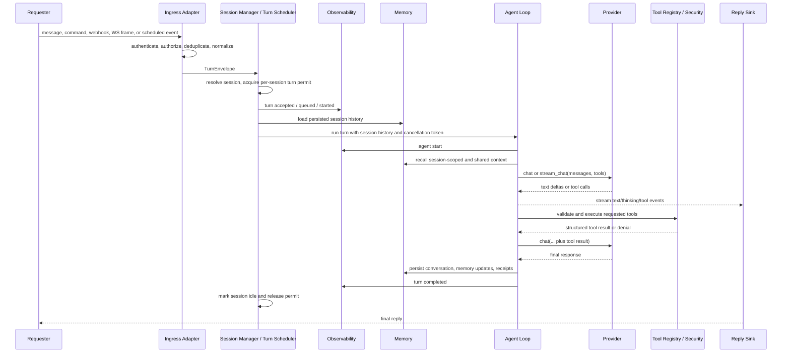

# ZeroClaw System Specification

Status: Draft v1 (language-agnostic)

Purpose: Define a portable autonomous agent runtime that can be implemented in
any programming language or technology stack while preserving ZeroClaw's
component model, extension surfaces, safety boundaries, and operational flows.

## Normative Language

The key words `MUST`, `MUST NOT`, `REQUIRED`, `SHOULD`, `SHOULD NOT`,
`RECOMMENDED`, `MAY`, and `OPTIONAL` in this document are to be interpreted as
described in RFC 2119.

`Implementation-defined` means the behavior is part of the implementation
contract, but this specification does not prescribe one universal policy.
Implementations MUST document the selected behavior.

`Portable implementation` means an implementation that satisfies the behavioral
contracts in this specification without depending on Rust, Cargo, Tokio, Axum,
or any other ZeroClaw-specific implementation choice.

## Research Basis

This specification is intentionally written as a repository-local system
contract rather than a tutorial. It follows the style of OpenAI Symphony's
language-agnostic `SPEC.md`, which defines problem statement, goals, components,
domain models, workflows, state transitions, and conformance criteria for an
agent orchestration service:
<https://github.com/openai/symphony/blob/main/SPEC.md>.

It also incorporates lessons from OpenAI's harness engineering writeup:
agent-friendly systems need legible repository-local knowledge, strict
boundaries, mechanical guardrails, observable feedback loops, and executable
validation rather than only prose instructions:
<https://openai.com/index/harness-engineering/>.

Additional interoperability references:

- Symphony article: issue trackers and workspaces can act as agent control
  planes; written specs can supervise agent-created implementations:
  <https://openai.com/index/open-source-codex-orchestration-symphony/>.
- Model Context Protocol: tool/resource/prompt extension should use explicit
  capabilities, lifecycle negotiation, and JSON-RPC-compatible messages:
  <https://modelcontextprotocol.io/specification/2025-03-26/basic>.
- Agent Client Protocol: editor and IDE clients should interact with agents
  through JSON-RPC methods, notifications, sessions, streaming updates, and
  permission requests:
  <https://agentclientprotocol.com/protocol/overview>.
- OpenTelemetry: observability should preserve separation of concerns across
  traces, metrics, logs, baggage/context, resources, and exporters:
  <https://opentelemetry.io/docs/specs/otel/overview/>.
- OpenAI agent tracing and eval guidance: production-grade agents need traces of
  model calls, tool calls, guardrails, handoffs, datasets, and repeatable evals:
  <https://openai.github.io/openai-agents-python/tracing/> and
  <https://platform.openai.com/docs/guides/agent-evals>.

## 1. Problem Statement

ZeroClaw is a personal, provider-agnostic autonomous agent runtime. It accepts
messages from local and remote channels, runs an agent loop over one or more LLM
providers, executes tool calls under security policy, persists memory, exposes
operator and programmatic control surfaces, and can be extended with providers,
channels, tools, memory backends, observers, runtime adapters, SOPs, MCP
servers, and plugins.

The system solves these operational problems:

- It lets one long-running agent serve many user-facing surfaces: CLI, chat
  platforms, webhooks, REST, WebSocket, voice, email, and IDEs.
- It decouples model providers from runtime logic so hosted, local, routed, and
  fallback models can be swapped through configuration.
- It exposes tools to the model while enforcing workspace, autonomy, approval,
  rate, cost, sandbox, and audit boundaries before any side effect happens.
- It preserves useful context through memory, retrieval, response caches,
  conversation history, skills, SOP run state, and session persistence.
- It keeps extension points narrow and explicit so a new platform, tool, memory
  backend, observer, or runtime can be added without rewriting the core agent
  loop.
- It provides enough observability for operators and coding agents to debug
  provider calls, tool calls, security decisions, channel traffic, cost, and
  long-running automation.

Important boundary:

- ZeroClaw is an agent runtime, not a single workflow application.
- Channels deliver and receive messages; they do not own model reasoning.
- Providers perform inference; they do not decide security policy.
- Tools perform capabilities; they do not bypass policy enforcement.
- The runtime coordinates turns, state, policy, memory, streaming, and
  automation.
- Concrete provider APIs, chat platforms, browsers, databases, and
  operating-system sandboxes are adapter concerns.

## 2. Goals and Non-Goals

### 2.1 Goals

- Provide one canonical agent turn loop with model calls, tool calls, tool
  results, memory context, history trimming, and final answer production.
- Support multiple inbound and outbound channels through a stable channel
  adapter interface.
- Support multiple LLM providers through a stable provider interface, including
  streaming, native tool calls, prompt-guided fallback tool calls, vision,
  prompt caching, fallback chains, and model routing.
- Support agent-callable tools through a stable tool interface based on names,
  descriptions, JSON Schemas, structured input, and structured output.
- Enforce security on every channel message and every tool call before side
  effects occur.
- Persist memory through replaceable backends and retrieve relevant memory into
  agent context.
- Expose operator controls through CLI, HTTP, WebSocket, ACP, logs, metrics,
  health checks, and audit artifacts.
- Support scheduled and event-triggered automation through cron jobs, heartbeat
  tasks, SOP definitions, webhooks, and MQTT.
- Support extension through in-process adapters, MCP servers, WASM plugins, and
  skill bundles.
- Keep user-facing text localizable while leaving logs, tracing events, and
  panic/internal diagnostics stable and English.
- Define conformance tests that let a coding agent recreate a similar runtime
  and verify that the result behaves like ZeroClaw.

### 2.2 Non-Goals

- Mandating Rust, async Rust, Cargo features, Axum, SQLite, Tokio, or any
  implementation-specific dependency.
- Mandating one provider, one model API, or one model message format.
- Mandating one database, vector store, tracing backend, web framework, browser
  automation engine, plugin VM, or sandbox backend.
- Prescribing every built-in channel or tool. Implementations can be conformant
  with a smaller catalog if the extension contracts are present.
- Treating any external service credential as portable test data. Specs,
  examples, fixtures, and tests MUST use neutral placeholders.
- Allowing docs to weaken safety policy. Security behavior must be enforced in
  code and verified by tests.

## 3. System Overview

### 3.1 Main Components

1. `Runtime Kernel`
   - Owns process startup, configuration load, workspace selection, dependency
     construction, and long-running task lifecycle.
   - Wires providers, memory, tools, channels, observers, security policy,
     schedulers, gateway, and automation engines.
   - Provides cancellation and graceful shutdown.

2. `Configuration Layer`
   - Loads a typed configuration document from an implementation-defined
     location.
   - Applies defaults, validates values, resolves secrets, and computes
     workspace paths.
   - Supports schema versioning and migration.

3. `Agent Loop`
   - Builds the system prompt from identity, safety policy, tools, skills,
     workspace facts, date/time, and memory context.
   - Sends chat requests to a provider.
   - Streams text/reasoning/tool-call events when supported.
   - Executes tool calls, feeds tool results back to the provider, and repeats
     until a final answer or max-iteration error.
   - Persists conversation state and memory updates.

4. `Provider Adapter Layer`
   - Normalizes inference providers behind a common interface.
   - Converts tool schemas to provider-native formats when possible.
   - Falls back to prompt-guided tool instructions when native tool calls are
     unavailable.
   - Supports routing and failover without changing the agent loop.

5. `Tool Registry`
   - Contains built-in, configured, plugin, MCP, skill, delegation, SOP, cron,
     and integration tools.
   - Presents tool specs to providers.
   - Executes tools only after security approval.

6. `Security Policy Engine`
   - Enforces channel access, pairing, autonomy level, path boundaries, shell
     command policy, approval gates, rate limits, cost budgets, OTP gates,
     emergency stop, sandboxing, prompt-injection checks, leak detection, and
     audit policy.

7. `Memory System`
   - Stores and recalls long-term facts, conversation history, daily notes,
     procedural memories, SOP audit records, response-cache entries, and
     optional vector embeddings.
   - Supports namespaces and sessions for isolation.

8. `Channel Adapter Layer`
   - Accepts inbound messages from CLI, chat platforms, email, voice, webhook,
     gateway, and ACP surfaces.
   - Emits outbound messages, streaming draft updates, multi-message replies,
     reactions, pins, redactions, and approval prompts where supported.

9. `Gateway`
   - Exposes HTTP endpoints, WebSocket chat, health checks, metrics, pairing,
     webhooks, optional dashboard assets, session APIs, and plugin APIs.

10. `Session Manager and Turn Scheduler`
    - Converts accepted requester input into session-scoped turns.
    - Owns session identity, default-session behavior, per-session queues,
      cancellation tokens, turn state, and global concurrency limits.
    - Ensures one mutable agent history is advanced by one active turn at a time
      for a given session.

11. `Automation Layer`
    - Runs cron jobs, heartbeat tasks, SOP event fan-in, SOP run state, scheduled
      agent prompts, scheduled shell jobs, and delivery rules.
    - Owns the SOP engine, which turns versioned Standard Operating Procedures
      into auditable runs triggered by events or explicit operator requests.

12. `Extension Layer`
    - Loads MCP servers, WASM plugins, skill bundles, CLI delegation tools, and
      optional external integration tools.

13. `Observability Layer`
    - Emits structured events, metrics, logs, runtime traces, receipts, health
      status, and optional OpenTelemetry/Prometheus exports.

### 3.2 Portable Layering

Implementations SHOULD preserve these dependency directions:

1. `API Contracts`
   - Provider, Channel, Tool, Memory, Observer, RuntimeAdapter,
     SessionBackend, TurnScheduler.

2. `Core Runtime`
   - Agent loop, security policy, memory loading, history, prompt assembly,
     tool dispatch, session management.

3. `Edge Adapters`
   - Providers, channels, gateway, browser, shell, HTTP, storage, MCP, plugins.

4. `Automation`
   - Cron, heartbeat, SOP, routines, background queues.

5. `Operations`
   - CLI, onboarding, docs, observability, service management, release tooling.

The core runtime MUST depend on abstract contracts, not concrete provider,
channel, tool, or storage implementations.

### 3.3 External Dependencies

Portable implementations MAY use different concrete dependencies, but MUST
define equivalents for:

- LLM provider APIs or local inference runtimes.
- Filesystem or object-storage workspace.
- Durable memory backend or explicit no-memory backend.
- Structured logging and error reporting.
- Optional metrics/tracing backend.
- Optional HTTP/WebSocket gateway.
- Optional OS process/shell execution.
- Optional sandbox backend.
- Optional browser automation environment.
- Optional message-channel APIs.
- Optional MCP/JSON-RPC client.
- Optional plugin runtime.

### 3.4 Big-Picture Request Flow

Every user-facing input follows the same logical path, regardless of whether it
arrives from CLI, a messaging channel, webhook, gateway HTTP POST, gateway
WebSocket, ACP, cron, or an SOP trigger.

The diagram is normative at the component-boundary level:

- Requesters never call the provider or tools directly.
- Ingress adapters authenticate and normalize, then hand off a `TurnEnvelope`.
- The session manager owns session selection and turn scheduling.
- The agent loop owns prompt assembly, provider calls, tool-call iteration, and
  final response production.
- Memory is read before prompt assembly and written after accepted user,
  assistant, tool, and audit events.
- Observability receives lifecycle events from ingress, session scheduling,
  memory, provider, tool, security, SOP, and final-response paths.
- Reply sinks stream or send output through the same surface that initiated the
  turn unless routing policy explicitly selects another destination.

### 3.5 Sessions and Turn Scheduling

A session is the unit of conversational history, memory scoping, cancellation,
and turn serialization.

ZeroClaw does not currently create one universal durable session whose ID is
`main`. Instead, session identity is requester-specific:

- CLI interactive mode without a session-state file uses an in-memory history
  for the running process. It has no durable session ID and memory operations
  use no session filter.
- CLI interactive mode with a session-state file persists chat history in that
  file and uses `cli:<session_state_file_path>` as the memory session ID.
- Gateway WebSocket uses a caller-supplied `session_id` or generates a UUID.
  Its durable session backend key is `gw_<session_id>`, while agent memory uses
  the raw `session_id`.
- Channel adapters derive conversation history keys from channel identity,
  reply target, optional thread ID, and sender.
- Cron agent jobs create isolated session paths of the form `cron-<run_id>` and
  use memory cleanup keys of the form `cli:cron-<run_id>` on failed runs.

Portable implementations MAY introduce a canonical `main` session, but doing so
is an architectural normalization rather than an exact match for the current
ZeroClaw implementation.

Session keys MUST be stable, namespaced, and non-secret. Examples:

- `cli:<session_state_file_path>`.
- `gw_<session_id>`.
- `gateway:<uuid>`.
- `telegram:<chat_id>:<sender_id>`.
- `discord:<guild_id>:<channel_id>:<thread_id>`.
- `cron:<run_id>`.
- `sop:<run_id>`.

The session manager MUST provide these guarantees:

- At most one active turn may mutate a given session at a time.
- Additional turns for the same session MUST be queued in FIFO order, rejected
  with a structured queue-full error, or cancel/replace the active turn under a
  documented interrupt policy.
- Different sessions MAY run in parallel up to a configured global concurrency
  limit.
- A turn MUST have a stable `turn_id`, session key, requester identity, reply
  sink, cancellation token, and trace context before entering the agent loop.
- Session state MUST move through `queued`, `running`, and then `idle`,
  `cancelled`, or `error`.
- Session history MUST be loaded before the turn begins and persisted after the
  turn completes or after each streaming checkpoint when supported.
- Cancellation MUST be scoped to the session/turn and MUST not cancel unrelated
  sessions.

The agent loop itself MUST be treated as session-local mutable state. A runtime
MUST NOT call the same session's agent loop concurrently with two user messages
unless the implementation proves that history mutation, memory writes, tool
state, and streaming persistence remain serializable.

### 3.6 One Successful Turn

A successful user turn proceeds as follows:

1. A requester sends input through CLI, a channel, gateway POST, gateway
   WebSocket, ACP, webhook, cron, or SOP.
2. The ingress adapter validates transport security: token, signature, pairing,
   allowlist, origin, replay/idempotency key, payload size, and media policy.
3. The ingress adapter normalizes the input into `TurnEnvelope`, including
   content, attachments, requester identity, session hint, reply sink, and
   trace context.
4. The session manager resolves the session key. If no session is provided, it
   uses the requester-specific default described in Section 3.5.
5. The turn scheduler applies debounce or interrupt policy if configured,
   acquires the per-session turn permit, checks global concurrency limits, and
   marks the session `running`.
6. Observability emits ingress accepted, turn queued, and turn started events.
7. The session backend loads persisted chat history for the session. The memory
   backend recalls relevant session-scoped and shared memories.
8. The agent loop builds the system prompt from identity, safety policy, tools,
   skills, workspace facts, date/time, SOP context when present, and memory
   context.
9. The provider adapter receives a `ChatRequest` with normalized messages,
   model selection, temperature, and filtered tool specs.
10. Provider text, thinking, tool-call, and final events are converted to
    runtime `TurnEvent`s and streamed to the reply sink when supported.
11. If the model requests tools, the agent loop validates tool name and
    arguments, invokes the security policy, asks for approval when required,
    executes through the tool registry, records receipts, and appends tool
    results to the conversation.
12. The agent loop repeats provider calls until a final response, cancellation,
    error, or max-iteration limit.
13. The reply sink sends the final response through the originating CLI,
    channel, gateway connection, webhook response, or configured delivery
    target.
14. Memory/session persistence stores accepted user input, assistant output,
    tool calls, tool results, receipts, and optional summaries. SOP run state is
    updated if the turn was part of an SOP.
15. Observability emits provider, memory, security, tool, SOP, and final turn
    metrics/traces/logs. Observer flush is deferred to shutdown unless the sink
    requires per-turn flushing.
16. The scheduler marks the session `idle`, releases the session permit, and
    starts the next queued turn for that session if one exists.

## 4. Core Domain Model

### 4.1 `Config`

The configuration object is the root runtime contract.

Required logical fields:

- `schema_version` integer.
- `workspace_dir` absolute path or implementation-defined workspace handle.
- `providers` provider profile map and default/fallback selection.
- `agent` agent-loop limits and context behavior.
- `autonomy` security posture and approval rules.
- `security` sandbox, pairing, OTP, emergency stop, prompt guard, secret policy.
- `channels` per-channel configuration.
- `memory` memory backend and retrieval configuration.
- `gateway` HTTP/WebSocket gateway configuration.
- `sessions` session backend, default session, queue, and cancellation
  configuration.
- `observability` logs, metrics, traces, and runtime trace configuration.
- `runtime` execution-environment adapter configuration.
- `tools` or tool-specific sections for browser, HTTP, web search, shell, MCP,
  plugins, integrations, and delegation.
- `cron`, `scheduler`, `heartbeat`, `sop`, and `hooks` automation settings.

Implementations MAY group fields differently, but MUST preserve the same
logical controls.

### 4.2 `ChatMessage`

Fields:

- `role` string: one of `system`, `user`, `assistant`, `tool`, or an
  implementation-defined provider role.
- `content` string.

Role semantics:

- `system` messages carry identity, policy, tool, skill, workspace, and safety
  instructions.
- `user` messages carry user content plus runtime-added date/time and optional
  memory context.
- `assistant` messages carry model output.
- `tool` messages carry tool results.

### 4.3 `ConversationMessage`

A durable conversation-history entry.

Variants:

- `Chat(ChatMessage)`.
- `AssistantToolCalls` with:
  - `text` optional assistant text.
  - `tool_calls` list of `ToolCall`.
  - `reasoning_content` optional opaque provider reasoning payload.
- `ToolResults` list of `ToolResultMessage`.

Implementations MUST preserve enough tool-call history to send valid follow-up
requests to providers that require native tool-call round trips.

### 4.4 `ChatRequest`

Fields:

- `messages` ordered list of normalized chat messages.
- `tools` optional list of `ToolSpec`.

The agent loop MUST decide whether tool specs are included for each provider
call based on dispatcher mode, provider capability, channel policy, tool
filtering, and deferred MCP activation state.

### 4.5 `ChatResponse`

Fields:

- `text` optional string.
- `tool_calls` list of `ToolCall`.
- `usage` optional token/cost metadata.
- `reasoning_content` optional opaque provider reasoning payload.

A response MAY contain both text and tool calls.

### 4.6 `ToolCall`

Fields:

- `id` stable call ID. If absent from provider output, runtime MUST assign one
  before emitting events or recording results.
- `name` tool name.
- `arguments` JSON object or string containing JSON.

Tool-call parsing MUST tolerate provider-specific native formats and supported
text fallback formats, but MUST NOT execute malformed arguments as guessed
commands. Parsing failure must become a model-visible tool/result error.

### 4.7 `ToolSpec`

Fields:

- `name` string unique within the exposed registry.
- `description` localized/user-facing description.
- `parameters` JSON Schema object.

Tool descriptions shown to users or model-visible UI SHOULD be localizable.
Tool names MUST be stable ASCII identifiers.

### 4.8 `ToolResult`

Fields:

- `success` boolean.
- `output` string shown to the model.
- `error` optional string.
- `receipt` optional tool execution receipt.
- `duration` optional execution duration.

Tool outputs MUST be scrubbed for known credential patterns before returning to
the model or logs unless an implementation has an explicit safe exception.

### 4.9 `MemoryEntry`

Fields:

- `id` string.
- `key` string.
- `content` string.
- `category` one of `core`, `daily`, `conversation`, or custom string.
- `timestamp` RFC 3339 or equivalent sortable timestamp.
- `session_id` optional string.
- `namespace` string, default `default`.
- `score` optional relevance score.
- `importance` optional 0.0 to 1.0 score.
- `superseded_by` optional memory entry ID.

Reserved auto-save keys:

- Assistant-authored autosave keys, such as `assistant_resp*`, MUST NOT be
  re-injected as trusted semantic memory.
- Raw user-message autosave keys, such as `user_msg*`, SHOULD be excluded from
  semantic context assembly to avoid exponential context growth.

### 4.10 `Session`

A session is the durable conversation container used by the runtime.

Fields:

- `session_id` stable logical ID when the requester has one. CLI in-memory mode
  MAY have no session ID.
- `session_key` stable namespaced string.
- `display_name` optional human-readable label.
- `workspace_id` or workspace path.
- `state`: `queued`, `running`, `idle`, `cancelled`, or `error`.
- `active_turn_id` optional current turn ID.
- `created_at`.
- `last_activity_at`.
- `message_count`.
- `default_for` optional requester class, such as `cli`, `gateway`, `channel`,
  `cron`, or `sop`.

Session backends MUST support loading, appending, updating the latest assistant
message during streaming, listing, renaming, deleting, and reporting running
state. Implementations MAY store sessions in files, SQLite, object storage, or
another durable backend.

### 4.11 `TurnEnvelope`

`TurnEnvelope` is the canonical handoff from an ingress adapter to the session
manager and agent loop.

Fields:

- `turn_id` stable unique ID.
- `source_kind`: `cli`, `channel`, `gateway_http`, `gateway_ws`, `acp`,
  `webhook`, `cron`, or `sop`.
- `source_name` implementation-defined source label.
- `requester_id` authenticated user, sender, device, job, or system identity.
- `content` normalized text content.
- `attachments` normalized media attachments.
- `session_hint` optional requested session ID.
- `resolved_session_key` set by the session manager.
- `reply_sink` descriptor for CLI stdout, channel target, WebSocket stream,
  HTTP response stream, ACP session, webhook callback, or delivery target.
- `thread_id` optional platform thread or interruption scope.
- `idempotency_key` optional duplicate-suppression key.
- `auth_context` authorization decision and claims.
- `trace_context` distributed trace or runtime trace ID.
- `cancellation_token`.
- `metadata` implementation-defined structured values.

Ingress adapters MUST populate all fields they can know and MUST leave session
resolution to the session manager unless the adapter is itself the session
authority, such as ACP `session/prompt`.

### 4.12 `ChannelMessage`

Fields:

- `id` platform message ID.
- `sender` normalized sender identity.
- `reply_target` destination for replies.
- `content` text content.
- `channel` channel name.
- `timestamp` integer or timestamp.
- `thread_ts` optional platform reply-thread anchor.
- `interruption_scope_id` optional cancellation/isolation key.
- `attachments` list of media attachments.

Channel adapters MUST normalize platform-native payloads into this shape before
the agent loop receives them.

### 4.13 `SendMessage`

Fields:

- `content` outbound text.
- `recipient` destination.
- `subject` optional subject/title.
- `thread_ts` optional reply-thread anchor.
- `cancellation_token` optional cancellation handle.
- `attachments` optional media attachments.

Channels that do not support a field MAY ignore it, but MUST document ignored
capabilities.

### 4.14 `ApprovalRequest`

Fields:

- `tool_name`.
- `arguments_summary`.
- `risk_level`.
- `recipient` or operator target.
- `timeout`.

Responses:

- `approve`: allow this call once.
- `deny`: deny this call.
- `always`: allow this tool for a session-scoped or policy-scoped duration,
  unless the tool is configured as always-ask.

### 4.15 `SecurityPolicy`

Fields:

- `autonomy`: `read_only`, `supervised`, or `full`.
- `workspace_dir`.
- `workspace_only` boolean.
- `allowed_commands`.
- `forbidden_paths`.
- `allowed_roots`.
- `max_actions_per_hour`.
- `max_cost_per_day_cents`.
- `require_approval_for_medium_risk`.
- `block_high_risk_commands`.
- `auto_approve` tool names.
- `always_ask` tool names.
- `non_cli_excluded_tools`.
- `shell_env_passthrough`.
- `shell_timeout_secs`.

### 4.16 `RuntimeAdapter`

Fields and methods:

- `name`.
- `has_shell_access`.
- `has_filesystem_access`.
- `storage_path`.
- `supports_long_running`.
- `memory_budget`.
- `build_shell_command(command, workspace_dir)`.

The runtime adapter allows native, Docker, serverless, mobile, embedded, or
browser-hosted implementations to expose different capabilities without
changing the agent loop.

### 4.17 `SOP`

An SOP is a versioned operational runbook. It describes when a procedure should
start, what ordered steps must happen, which tools are suggested or allowed, and
where human checkpoints are required.

The SOP component exists to keep recurring or high-impact workflows explicit,
reviewable, repeatable, and auditable. Without SOPs, an agent must infer
procedure from free-form prompts each time. With SOPs, operators can encode
known incident response, deployment, recovery, maintenance, or handoff
procedures as data that the runtime can validate, trigger, supervise, and
record.

An SOP definition is not itself a tool execution. It is a procedural contract
that the SOP engine turns into run actions. Those actions then flow through the
normal agent loop, tool registry, approval handling, security policy, memory,
and observability paths.

Fields:

- `name`.
- `description`.
- `version`.
- `priority`: `low`, `normal`, `high`, `critical`.
- `execution_mode`: `auto`, `supervised`, `step_by_step`,
  `priority_based`, or `deterministic`.
- `triggers`: list of MQTT, webhook, cron, or manual triggers.
- `steps`: ordered list of SOP steps.
- `cooldown_secs`.
- `max_concurrent`.
- `deterministic` boolean.

Step fields:

- `number`.
- `title`.
- `body`.
- `suggested_tools`.
- `requires_confirmation`.
- `kind`: `execute` or `checkpoint`.
- `schema` optional JSON Schema for input/output validation.

Trigger fields:

- `source`: `mqtt`, `webhook`, `cron`, or `manual`.
- `match`: implementation-defined matcher such as topic, path, schedule,
  event-type, label, or predicate.
- `payload_schema` optional JSON Schema for accepted event payloads.
- `auth_policy` optional reference to channel, webhook, or gateway policy.

Run state fields:

- `run_id`.
- `sop_name`.
- `trigger_event`.
- `status`: `queued`, `running`, `waiting_approval`, `completed`, `failed`, or
  `cancelled`.
- `current_step`.
- `total_steps`.
- `step_results`.
- `approval_records`.
- `started_at`, `updated_at`, and optional `completed_at`.
- `audit_ref` optional durable memory or log reference.

SOP run actions:

- `ExecuteStep`: send step context to the agent loop or deterministic executor.
- `WaitApproval`: pause until an authorized operator approves, denies, or
  advances the run.
- `Complete`: mark run complete and persist final audit state.
- `Fail`: mark run failed with structured reason.
- `Cancel`: stop the run and persist cancellation reason.

### 4.18 `CronJob`

Fields:

- `id`.
- `schedule`: cron expression, absolute time, or interval.
- `command` shell command or agent prompt payload.
- `prompt` optional agent prompt.
- `name` optional label.
- `job_type`: `shell` or `agent`.
- `session_target`: `isolated` or `main`.
- `model` optional model override.
- `enabled` boolean.
- `delivery` output delivery configuration.
- `delete_after_run` boolean.
- `allowed_tools` optional allowlist.
- `uses_memory` boolean.
- `source`: `imperative` or `declarative`.
- `created_at`, `next_run`, `last_run`, `last_status`, `last_output`.

### 4.19 `PluginManifest`

Fields:

- `name`.
- `version`.
- `description` optional.
- `author` optional.
- `wasm_path` optional for skill-only plugins, required for WASM plugins.
- `capabilities`: `tool`, `channel`, `memory`, `observer`, or `skill`.
- `permissions`: such as `http_client`, `env_read`, `file_read`,
  `file_write`, `memory_read`, `memory_write`.
- `signature` optional.
- `publisher_key` optional.

Signature verification MAY be disabled, permissive, or strict. Strict mode MUST
reject unsigned or untrusted plugins.

### 4.20 `ObserverEvent` and `ObserverMetric`

Required event categories:

- Agent start and end.
- LLM request and response.
- Tool call start and finish.
- Turn completion.
- Ingress accepted, queued, rejected, cancelled, and started.
- Session state changes.
- Channel inbound and outbound message.
- Heartbeat tick.
- Cache hit and miss.
- Error.
- Automation, deployment, recovery, or SOP lifecycle events as applicable.

Required metric categories:

- Request latency.
- Tokens used.
- Active sessions.
- Queue depth.
- Tool duration and outcome.
- Automation duration and outcome where automation is implemented.

## 5. Core Interfaces

### 5.1 Provider Interface

Required methods:

- `capabilities() -> ProviderCapabilities`.
- `chat_with_system(system_prompt, message, model, temperature) -> text`.
- `chat(request, model, temperature) -> ChatResponse`.
- `list_models() -> list<string>` or unsupported error.
- `supports_native_tools() -> bool`.
- `supports_streaming() -> bool`.
- `supports_streaming_tool_events() -> bool`.
- `stream_chat(request, model, temperature, options) -> stream<StreamEvent>`.
- `convert_tools(tool_specs) -> ToolsPayload`.

Provider capabilities:

- `native_tool_calling`.
- `vision`.
- `prompt_caching`.

Tool payload formats:

- Provider-native format.
- OpenAI-compatible format.
- Anthropic-compatible format.
- Gemini-compatible format.
- Prompt-guided instructions.

Provider implementations MUST:

- Preserve provider-specific reasoning payloads when needed for round-trip API
  validity.
- Map provider token usage into normalized usage fields when available.
- Return structured capability errors for unsupported features.
- Avoid leaking credentials in errors and logs.
- Support default temperature, max token, timeout, base URL, and wire protocol
  values.

### 5.2 Channel Interface

Required methods:

- `name()`.
- `send(SendMessage)`.
- `listen(sender<ChannelMessage>)`.
- `health_check()`.

Optional capabilities:

- typing indicator start/stop.
- draft send/update/progress/finalize/cancel.
- multi-message streaming.
- reactions.
- pin/unpin.
- redact.
- interactive approval request.

Channel implementations MUST:

- Enforce channel-local allowlists, pairing, destination restrictions, and
  mention policies before delivering inbound messages to the runtime.
- Normalize inbound messages into `ChannelMessage`.
- Preserve thread identity where the platform supports it.
- Report unsupported operations without panicking.
- Keep approval prompts scoped to the correct recipient/conversation.

### 5.3 Tool Interface

Required methods:

- `name()`.
- `description()`.
- `parameters_schema()`.
- `execute(args) -> ToolResult`.

Tool implementations MUST:

- Validate argument shape before side effects.
- Return structured success/error output.
- Be safe to call concurrently unless documented otherwise.
- Avoid logging secrets or raw credentials.
- Declare all model-visible arguments through JSON Schema.

Tools SHOULD be wrapped by policy middleware for path guarding, rate limiting,
approval, receipts, and cancellation rather than reimplementing those gates in
every tool.

### 5.4 Memory Interface

Required methods:

- `name()`.
- `store(key, content, category, session_id)`.
- `recall(query, limit, session_id, since, until)`.
- `get(key)`.
- `list(category, session_id)`.
- `forget(key)`.
- `count()`.
- `health_check()`.

Recommended methods:

- `purge_namespace`.
- `purge_session`.
- `store_procedural`.
- `recall_namespaced`.
- `export(filter)`.
- `store_with_metadata`.

Memory implementations MUST support a no-op `none` backend for privacy- or
stateless deployments.

### 5.5 Observer Interface

Required methods:

- `record_event(event)`.
- `record_metric(metric)`.
- `flush()`.
- `name()`.

Observers MUST avoid blocking the hot path. Slow exports SHOULD be buffered and
flushed asynchronously or at shutdown.

### 5.6 Session Backend and Turn Scheduler Interface

Required session backend methods:

- `load(session_key) -> list<ChatMessage>`.
- `append(session_key, message)`.
- `update_last(session_key, message)`.
- `list_sessions()`.
- `delete_session(session_key)`.
- `set_session_state(session_key, state, turn_id)`.
- `get_session_state(session_key)`.

Required turn scheduler methods:

- `resolve_session(turn_envelope) -> session_key`.
- `enqueue_or_acquire(session_key, turn_id) -> turn_permit`.
- `release(turn_permit, final_state)`.
- `cancel(session_key, turn_id)`.
- `queue_depth(session_key)`.

Implementations MUST serialize turns per session and MAY process different
sessions in parallel. Queue limits, lock timeouts, and interrupt behavior MUST
be observable and documented.

### 5.7 Runtime Adapter Interface

Runtime adapters MUST report capability flags before the agent registers tools.
If `has_shell_access` is false, shell-based tools and CLI delegation tools MUST
be disabled or replaced by explicit unsupported-tool errors.

## 6. Configuration Contract

### 6.1 Resolution Pipeline

Configuration resolution MUST follow this logical pipeline:

1. Determine config root and workspace root.
2. Read the config document.
3. Parse to a raw object.
4. Apply schema defaults.
5. Resolve secret references.
6. Normalize paths and URLs.
7. Validate values.
8. Run migrations if schema version requires them.
9. Construct typed runtime objects.

Implementations MAY support environment variable overrides, but MUST document
which fields can be overridden and precedence order.

### 6.2 Defaults

Portable defaults:

- `autonomy.level = supervised`.
- `autonomy.workspace_only = true`.
- `autonomy.require_approval_for_medium_risk = true`.
- `autonomy.block_high_risk_commands = true`.
- `gateway.host = 127.0.0.1`.
- `gateway.require_pairing = true`.
- `gateway.allow_public_bind = false`.
- `sessions.default = requester-specific`.
- `sessions.per_session_concurrency = 1`.
- `sessions.max_queue_depth = 8`.
- `sessions.lock_timeout_secs = 30`.
- `sessions.idle_ttl_secs = 600`.
- `agent.max_tool_iterations = 10`.
- `agent.max_history_messages = 50`.
- `agent.max_context_tokens = 32000`.
- `agent.parallel_tools = false`.
- `memory.backend = sqlite` or closest embedded durable backend.
- `memory.auto_hydrate = true` when snapshots are implemented.
- `observability.backend = none` or local logs, but security-relevant events
  MUST still be available in development builds.

### 6.3 Provider Config

Provider profiles MUST include:

- provider kind/name.
- model ID.
- credential reference or auth mode.
- optional base URL.
- optional API path.
- optional timeout.
- optional temperature.
- optional max tokens.
- optional wire protocol.
- optional extra headers/body parameters.

Provider config MUST support:

- hosted native providers.
- OpenAI-compatible endpoints.
- local providers.
- fallback chains.
- route-by-hint maps.

### 6.4 Channel Config

Channel configs SHOULD include:

- `enabled`.
- credentials.
- allowed users/senders.
- allowed destinations.
- mention policy.
- optional provider/model override.
- optional draft update interval.
- optional tool allow/deny policy.
- optional approval timeout.

### 6.5 Tool and MCP Config

MCP server config MUST include:

- `name`.
- `transport`: `stdio`, `http`, or `sse` if implemented.
- transport-specific command or URL.
- optional environment variables, headers, timeouts, and auth data.
- optional deferred loading flag.

Tool-specific configs SHOULD be isolated under named sections so they can be
omitted safely when the tool is disabled.

### 6.6 Validation Errors

Implementations MUST surface configuration errors as operator-visible messages.
Required error classes:

- missing config.
- parse error.
- schema validation error.
- unsupported provider.
- missing required credential.
- invalid path.
- invalid URL.
- invalid autonomy or security value.
- invalid channel config.
- invalid plugin manifest.
- invalid SOP definition.

Startup MAY fail for invalid mandatory config. Runtime reload MUST NOT crash a
long-running service; it SHOULD keep the last known good config.

## 7. Agent Turn Lifecycle

The agent turn lifecycle begins only after ingress validation, session
resolution, and turn-scheduler admission have succeeded. The agent loop receives
one session's mutable history, a `TurnEnvelope` or equivalent request context,
an observer, memory backend, tool registry, security policy, reply sink, and
cancellation token.

Implementations MAY construct a fresh agent object per turn or keep one agent
object per session, but the externally visible behavior MUST be the same:
history order, memory writes, approval scope, tool receipts, and streamed events
must appear as one serialized turn for that session.

### 7.1 Non-Streaming Turn

Algorithm:

1. If history is empty, build and append the system prompt.
2. Recall memory context for the user message and session.
3. If auto-save is enabled, store the user message as conversation memory.
4. Add current date/time to the user message.
5. Append the enriched user message to conversation history.
6. Select the effective model through classification/routing rules.
7. Repeat until final answer or `agent.max_tool_iterations`:
   - Convert conversation history into provider messages.
   - Filter tool specs by channel, allowed tools, MCP groups, and dispatcher
     mode.
   - If response cache is eligible, return cached text on hit.
   - Call provider `chat`.
   - Parse provider response into text and tool calls.
   - If no tool calls, append assistant text, cache if eligible, trim history,
     persist as needed, and return final text.
   - Append assistant tool-call history.
   - Validate and execute requested tools.
   - Append formatted tool results.
   - Trim history.
8. If the loop exceeds the iteration limit, return a model-visible and
   operator-visible max-iterations error.

### 7.2 Streaming Turn

Streaming follows the same lifecycle with these additions:

- Provider `stream_chat` SHOULD be attempted when supported.
- Text deltas MUST be forwarded as turn events.
- Reasoning deltas MAY be forwarded as separate thinking events if policy
  permits.
- Structured tool-call events MUST be collected and executed after a coherent
  tool-call boundary.
- Pre-executed provider-proxy tool events MUST be reported for observability but
  MUST NOT be executed again.
- Cancellation MUST interrupt provider streaming or tool execution and record an
  interrupted final state.
- If streaming produces no usable events, runtime MAY fall back to non-streaming
  `chat`.

### 7.3 Tool Execution

For each tool call:

1. Assign stable tool-call ID.
2. Emit `ToolCallStart` event.
3. Check unknown tool.
4. Parse and validate arguments.
5. Apply channel-specific tool restrictions.
6. Apply autonomy and risk policy.
7. Apply approval policy.
8. Apply rate and cost policy.
9. Apply workspace/path policy.
10. Apply sandbox/runtime policy.
11. Execute the tool or return denial as tool result.
12. Scrub output.
13. Generate receipt if enabled.
14. Emit `ToolCall` completion event.
15. Return structured result to the agent loop.

Parallel execution MAY be used only when:

- More than one call exists.
- None of the calls requires interactive approval.
- No call depends on another call in the same batch.
- No call mutates shared activation state needed by another call, such as
  deferred `tool_search`.

### 7.4 History and Context Management

Implementations MUST prevent unbounded history growth. Required mechanisms:

- maximum history messages.
- maximum estimated context tokens or equivalent budget.
- tool-result truncation.
- preservation of recent tool-call/result pairs for provider round-trip
  validity.
- optional summarization or compaction.

### 7.5 Response Cache

A response cache MAY be used when:

- temperature is deterministic, typically `0.0`.
- prompt is text-only.
- no tool calls are expected or returned.
- cache key includes model, system prompt, and current user prompt.

Cache hits MUST emit observability events. Cache entries MUST respect TTL and
max-entry limits.

## 8. Security Model

### 8.1 Security Layers

Every conformant implementation MUST provide these layers:

1. Channel access control.
2. Autonomy policy.
3. Workspace/path boundaries.
4. Tool risk classification.
5. Approval handling.
6. Audit and observability.

Implementations SHOULD also provide:

- OS sandbox.
- OTP gates.
- emergency stop.
- prompt-injection guard.
- leak detector.
- signed tool receipts.
- plugin signature policy.
- per-sender rate limits.
- cost budgets.

### 8.2 Autonomy Levels

`read_only`:

- Read-only tools MAY execute.
- Side-effecting tools MUST be blocked or require explicit operator override.
- Shell execution MUST be disabled unless a command is provably read-only and
  policy permits it.

`supervised`:

- Low-risk calls MAY execute automatically.
- Medium-risk calls MUST ask for approval by default.
- High-risk calls MUST be blocked by default.

`full`:

- Approval prompts MAY be skipped.
- Workspace, forbidden path, command, sandbox, OTP, emergency stop, rate, and
  cost boundaries MUST still apply unless explicitly disabled by documented
  configuration.

### 8.3 Risk Classification

Risk classes:

- `low`: read-only, local, bounded, no durable side effect.
- `medium`: local mutation, bounded network request, or recoverable action.
- `high`: destructive, credential-bearing, privileged, remote side effect,
  public posting, broad filesystem access, shell chaining, or unclear command.

Unknown tools and unknown shell commands SHOULD be high risk.

### 8.4 Workspace and Path Rules

Path policy MUST:

- Resolve relative paths against workspace.
- Expand user-home markers only in config or operator-controlled values.
- Reject traversal outside workspace when `workspace_only` is true.
- Always reject forbidden paths.
- Permit explicitly configured `allowed_roots`.
- Apply to file tools and shell commands that reference paths.

### 8.5 Shell Policy

Shell policy MUST:

- Parse commands enough to identify executable names and unsafe shell operators.
- Respect allowed commands.
- Block dangerous redirection, background execution, command substitution,
  suspicious variable expansion, destructive flags, and forbidden path access
  unless explicitly permitted.
- Run with a restricted environment.
- Enforce timeout.
- Return blocked commands as tool errors, not process panics.

### 8.6 Approval

Approval behavior:

- Approval requests MUST include tool name and argument summary.
- Approval prompts MUST be scoped to the channel/session/operator that initiated
  the action.
- Timeout MUST deny by default.
- `always` approvals MUST be session-scoped unless the implementation documents a
  stronger persistence rule.
- Tools in `always_ask` MUST ask every time.

### 8.7 Tool Receipts

When receipts are enabled:

- Each executed tool call MUST produce an unforgeable receipt using an
  implementation-held secret unknown to the model.
- Receipt input SHOULD include tool name, canonical arguments, result hash or
  output, timestamp, and optional previous receipt hash.
- Receipt verification MUST fail for changed tool name, arguments, output,
  timestamp, or key.
- Receipts SHOULD be stored in an append-only, day-sharded or otherwise durable
  audit log.

### 8.8 Secrets and Privacy

Implementations MUST:

- Never commit secrets in examples, tests, fixtures, or docs.
- Redact known secret patterns in logs and tool output.
- Keep credential storage outside project workspaces when possible.
- Support neutral placeholders in docs and test data.
- Treat memory, logs, traces, and receipts as potentially sensitive.

## 9. Provider System

### 9.1 Provider Families

Implementations SHOULD support these provider classes:

- Native hosted providers.
- OpenAI-compatible providers.
- Local providers.
- CLI-backed providers.
- OAuth-backed providers.
- Reliable/fallback wrapper provider.
- Router provider.

### 9.2 Fallback Chains

Fallback behavior:

1. Try primary provider/model.
2. On retryable failure, try next configured provider/model.
3. Preserve model/provider attempt metadata.
4. Surface all attempts if every provider fails.
5. Emit observability events for each attempt.

Fallback MUST NOT retry non-idempotent tool execution; it only applies to model
calls.

### 9.3 Routing

Routing MAY use:

- explicit user hints.
- query classification.
- channel-level provider override.
- tool or SOP context.
- model capability requirements such as vision or reasoning.

Routing decisions SHOULD be observable.

### 9.4 Tool Calling

Provider adapters MUST support at least one of:

- Native tool calling.
- Streaming native tool-call events.
- Prompt-guided textual tool-call syntax parsed by the dispatcher.

If native tools are unsupported, the provider adapter MUST add tool instructions
to the prompt in a deterministic, parseable format and MUST not claim native
tool-call support.

## 10. Tool System

### 10.1 Required Built-In Tool Categories

A minimal conformant runtime SHOULD include:

- shell or explicit unsupported shell tool.
- file read.
- file write or explicit read-only denial.
- file edit or equivalent patch/write capability.
- glob/list search.
- content search.
- memory store/recall/forget/export.
- HTTP request or web fetch.
- web search or explicit no-search backend.
- calculator/time utility.
- model routing/config inspection.
- session inspection.
- approval/human escalation.

Full implementations MAY include browser automation, PDF extraction, image
analysis, image generation, backup, data retention, project intelligence, cloud
advisory, notifications, social posting, Microsoft 365, Google Workspace,
Notion, Jira, LinkedIn, security operations, delegation tools, pipeline tools,
SOP tools, cron tools, and workspace-management tools.

### 10.2 Tool Registry Assembly

Tool assembly MUST:

- Start with default core tools.
- Add memory tools when memory is enabled.
- Add browser/http/web/search tools only when configured.
- Add runtime-dependent tools only when runtime capabilities permit.
- Add channel-backed tools with late-bound channel maps.
- Add SOP tools only when SOPs are configured.
- Add delegate/swarm tools only when agents/swarms are configured.
- Add MCP tools according to MCP config.
- Add plugin tools only after manifest validation and signature policy.

### 10.3 Tool Filtering

The exposed tool list MAY vary per turn. Filtering inputs:

- channel policy.
- user message keywords.
- MCP deferred loading groups.
- allowed tools for cron/delegated agents.
- autonomy restrictions.
- context-aware tool classifier.

Built-in tools SHOULD remain visible unless explicitly disabled. MCP tools MAY
be hidden until activated to reduce model context size.

### 10.4 Delegation and Swarms

Delegate tools let the main agent call sub-agents.

Sub-agent config SHOULD include:

- provider/model.
- timeout.
- allowed tools.
- system prompt or role.
- memory namespace.
- workspace path.

Delegated agents MUST obey the same security policy unless a stricter sub-policy
is configured.

Swarms MAY coordinate multiple named delegate agents, but MUST expose run state
and failure details.

## 11. Memory System

### 11.1 Backend Types

Implementations SHOULD support:

- `sqlite` or equivalent embedded durable backend.
- `markdown` or equivalent human-readable backend.
- `none`.
- optional external vector database.
- optional PostgreSQL or equivalent remote durable backend.
- optional sync bridge to external memory tools.

### 11.2 Retrieval

Retrieval MAY use:

- keyword/BM25.
- embeddings/vector similarity.
- hybrid search.
- reranking.
- cache stage.
- full-text stage.
- vector stage.

Retrieved memory MUST be bounded by count and relevance threshold. Irrelevant or
untrusted autosave entries SHOULD be filtered before prompt injection.

### 11.3 Namespaces and Sessions

Memory MUST support session scoping. Namespace isolation SHOULD be supported for
multi-workspace, delegated agents, and client/project boundaries.

Session-scoped conversation memory MUST NOT leak across unrelated requesters.
Shared long-term memory MAY be recalled across sessions only when the memory
category, namespace, security policy, and privacy configuration permit it. A
requester-specific session label or compatibility `main` alias is not a global
permission bypass.

### 11.4 Hygiene and Snapshots

Memory SHOULD support:

- archive after N days.
- purge after N days.
- conversation retention.
- audit retention.
- response cache TTL.
- snapshot export.
- auto-hydration from snapshot when primary memory is missing.
- conflict detection and supersession.

## 12. Channel System

### 12.1 Channel Classes

Implementations MAY support these classes:

- CLI.
- chat platforms.
- email.
- social/broadcast platforms.
- voice/telephony.
- webhooks.
- gateway REST/WebSocket.
- ACP over stdio or WebSocket.

### 12.2 Inbound Flow

1. Platform event arrives.
2. Adapter validates signature/token/pairing/allowlist.
3. Adapter deduplicates if the platform can retry.
4. Adapter normalizes event to `ChannelMessage`.
5. Adapter attaches media metadata.
6. Runtime converts the channel message into `TurnEnvelope`.
7. Session manager resolves sender/session/cancellation identity.
8. Turn scheduler queues or starts the turn.
9. Agent loop processes the turn after the per-session permit is acquired.

Rejected inbound events MUST be dropped before model invocation.

### 12.3 Outbound Flow

1. Runtime sends text or streaming updates to channel adapter.
2. Adapter chooses delivery mode:
   - draft edit.
   - multi-message streaming.
   - final single message.
   - email/voice-specific flush.
3. Adapter preserves thread target when available.
4. Adapter records outbound event.

### 12.4 Media Pipeline

Media attachments SHOULD be normalized into:

- content type.
- byte size.
- file/path/blob reference.
- transcription text if audio.
- image/video metadata if available.

Media processing MUST enforce max size, allowed content types, and credential
redaction.

### 12.5 ACP

ACP-compatible implementations SHOULD expose:

- `initialize`.
- `session/new`.
- `session/prompt`.
- `session/stop`.
- `session/update` notifications.
- optional `session/cancel`.
- optional permission request flow.

ACP messages MUST be JSON-RPC 2.0 compatible and, for stdio transport, newline
delimited UTF-8 with no non-protocol stdout.

## 13. Gateway Contract

### 13.1 Required Behavior

Gateway implementations SHOULD provide:

- `/health`.
- `/metrics` when metrics enabled.
- webhook ingress.
- WebSocket or streamable chat with session resume.
- HTTP POST or streamable request endpoint for one-shot turns.
- pairing/auth endpoints.
- session list/history/send APIs.
- session state, abort, delete, and rename APIs.
- memory CRUD/export APIs.
- config read/update APIs with secrets masked.
- tools listing API.
- cost/status APIs.
- channel/provider health APIs.

Gateway chat endpoints MUST produce `TurnEnvelope`s and pass through the same
session manager and turn scheduler used by channels and CLI. They MUST NOT
instantiate an unscheduled agent loop that can mutate the same session in
parallel with another requester.

### 13.2 Security

Gateway MUST:

- Bind localhost by default.
- Require pairing by default.
- Reject public bind unless explicitly enabled.
- Enforce request body limits.
- Enforce request timeouts.
- Rate-limit pairing and webhook routes.
- Deduplicate webhook requests when idempotency keys are supplied.
- Use constant-time token comparison.
- Mask secrets in config responses.
- Support TLS/mTLS where implemented and documented.

## 14. Automation

### 14.1 Cron

Cron scheduler MUST:

- Support recurring cron expressions.
- Support one-time absolute timestamps.
- Support fixed intervals.
- Persist job definitions and run history.
- Support enabled/disabled state.
- Support shell and agent job types.
- Support isolated or main session target.
- Support tool allowlists for agent jobs.
- Record last status and output.

### 14.2 Heartbeat

Heartbeat MAY periodically ask whether scheduled or health tasks should run.
Heartbeat output MUST avoid polluting semantic memory unless intentionally
stored.

### 14.3 SOP Engine

The SOP engine is the procedural automation component. It maps external or
manual events to named runbooks, creates durable run state, and advances each
run step-by-step until completion, failure, cancellation, or an approval wait.

The engine is deliberately separate from the agent loop. The agent loop decides
how to reason about a step and how to use tools. The SOP engine decides which
procedure is active, which step is current, whether the run may continue, and
what audit evidence must be persisted.

The engine is needed for four reasons:

- Repeatability: known workflows can run the same way across operators,
  channels, providers, and deployments.
- Supervision: checkpoint steps and execution modes make human control explicit
  instead of relying on model discretion.
- Auditability: every trigger, step result, approval, timeout, and final state
  can be recorded as operational evidence.
- Reliability: cooldowns, concurrency limits, deterministic mode, and schema
  validation reduce accidental duplicate or malformed workflow execution.

SOP engine MUST:

- Load SOP manifest and markdown body from workspace SOP directories.
- Validate metadata, triggers, and ordered steps.
- Reject definitions with missing names, duplicate step numbers, unsupported
  trigger sources, invalid schemas, or empty step lists.
- Match events from MQTT, webhook, cron, and manual sources.
- Validate trigger payloads before starting runs when a payload schema exists.
- Enforce cooldown and max concurrency.
- Create a durable run record before executing the first step.
- Support supervised, step-by-step, auto, priority-based, and deterministic
  execution modes if declared.
- Resolve each step to a run action: execute, wait for approval, complete, fail,
  or cancel.
- Format step context so the agent receives SOP name, run ID, step number,
  trigger payload, previous step results, and the current step body.
- Pause at checkpoint steps until approved or denied by an authorized operator.
- Record step results and advance exactly once per accepted result.
- Persist audit records.
- Expose tools or APIs for list, execute, advance, approve, and status.

Deterministic SOP mode MUST execute steps in order without model round trips,
validate schemas when provided, and pause at checkpoint steps.

SOP engine MUST NOT:

- Bypass channel authentication, gateway pairing, or webhook signature checks.
- Grant tools or permissions that the current security policy would otherwise
  deny.
- Execute side effects directly except through registered runtime tools or
  documented deterministic step executors.
- Treat a model-generated step result as operator approval.
- Hide failed or skipped steps from status, traces, metrics, or audit records.

SOP tools exposed to the agent SHOULD include:

- `sop_list`: list available SOP definitions.
- `sop_execute`: start a manual run.
- `sop_status`: inspect active and finished runs.
- `sop_approve`: approve or deny a waiting checkpoint.
- `sop_advance`: submit a step result and move the run forward.

SOP observability SHOULD include:

- run started, step started, step completed, checkpoint waiting, approval
  recorded, run completed, run failed, and run cancelled events.
- counters for active runs, completed runs, failed runs, approvals, timeout
  approvals, and per-SOP completion rate.
- trace spans for trigger matching, step execution, approval wait, and audit
  persistence.

## 15. Extension and Plugin System

### 15.1 MCP

MCP integration MUST:

- Treat each configured MCP server as a tool provider.
- Support lifecycle initialization and capability discovery.
- Support tool listing and invocation.
- Prefix or namespace tool names to avoid collisions.
- Support deferred schema loading if configured.
- Enforce ZeroClaw security policy on MCP tool calls.

HTTP-based MCP transports SHOULD follow MCP authorization guidance. Stdio MCP
servers SHOULD read credentials from environment or local config rather than
protocol auth fields.

### 15.2 WASM Plugins

WASM tool plugins MUST export:

- `tool_metadata(input: string) -> string`.
- `execute(input: string) -> string`.

`tool_metadata` MUST return JSON containing:

- `name`.
- `description`.
- `parameters_schema`.

`execute` MUST accept JSON arguments and return JSON `ToolResult`.

Host functions MUST be permission-gated by manifest permissions.

### 15.3 Skill Bundles

Skill bundles SHOULD:

- Use `SKILL.md` files with `name` and `description`.
- Keep scripts and references inside the skill directory.
- Register namespaced skill IDs.
- Avoid collisions with user-authored skills and other plugin bundles.

Skills MAY define tool-like behaviors, prompt sections, runbooks, or
agent-readable task procedures.

## 16. Observability and Operations

### 17.1 Logs

Logs SHOULD include:

- service lifecycle.
- config reload.
- channel connect/disconnect.
- provider call latency and token counts.
- tool call name, outcome, and duration.
- approval requests and decisions.
- security blocks.
- memory retrieval scores at debug level.
- errors with stable component keys.

Logs MUST redact credentials.

### 17.2 Metrics

Metrics SHOULD include:

- provider calls total by provider/outcome.
- provider latency histogram.
- tokens total by provider and direction.
- tool calls total by tool/outcome.
- tool duration histogram.
- channel events total by channel/direction.
- channel errors.
- memory search counts.
- policy block counts.
- active sessions.
- queue depth.
- cost counters.

### 17.3 Traces

Traces SHOULD represent:

- one inbound message or automation job as a trace.
- provider calls as spans.
- tool calls as spans.
- security validation as spans.
- memory search as spans.
- channel delivery as spans.
- SOP steps as spans.

Trace IDs SHOULD be propagated through logs and tool receipts when possible.

### 17.4 Health

Health endpoints or commands SHOULD report:

- runtime status.
- config validity.
- provider health.
- channel health.
- memory health.
- gateway status.
- scheduler status.
- sandbox availability.
- plugin load status.

### 17.5 Runtime Traces and Evals

Implementations SHOULD support a runtime trace artifact that can be replayed or
graded. Trace records SHOULD include enough structured data to answer:

- Did the model call the right tool?
- Did the security policy allow or block correctly?
- Did tool output cause a wrong follow-up?
- Did routing choose the expected provider/model?
- Did memory retrieval help or harm?
- Did the final response satisfy the task?

## 17. Localization

User-facing strings MUST be localizable:

- CLI messages.
- tool descriptions.
- onboarding prompts.
- approval prompts.
- dashboard labels where applicable.

Internal logs, trace event names, error keys, and panic messages SHOULD remain
stable English identifiers.

## 18. Lifecycle and Startup

Startup sequence:

1. Resolve config path and workspace.
2. Load and validate config.
3. Run schema migrations.
4. Initialize observers.
5. Initialize security policy.
6. Initialize memory backend and response cache.
7. Initialize provider selection.
8. Initialize tool registry.
9. Load skills.
10. Load MCP tools.
11. Load plugins.
12. Initialize channel adapters.
13. Initialize gateway.
14. Initialize cron, heartbeat, SOP, and automation engines.
15. Start listeners.
16. Emit ready health state.

Shutdown sequence:

1. Stop accepting new inbound messages.
2. Cancel in-flight turns or allow graceful drain according to config.
3. Stop channel listeners.
4. Stop gateway listeners.
5. Stop schedulers and automation loops.
6. Flush memory writes.
7. Flush observers.
8. Close receipts/audit files.

## 19. Failure Handling

Provider failure:

- Record failed attempt.
- Use fallback chain if configured.
- Return model-visible or operator-visible error if all attempts fail.

Tool failure:

- Return structured tool error to model.
- Record observability event.
- Continue loop unless cancellation or fatal policy violation occurs.

Security denial:

- Return denial as tool result.
- Record policy block.
- Do not perform side effect.

Channel failure:

- Retry delivery only when platform semantics are idempotent or documented.
- Record channel error.
- Avoid duplicate user-visible messages when possible.

Memory failure:

- Agent turn SHOULD continue without memory context when recall fails.
- Store failure SHOULD be logged but SHOULD NOT break final response unless the
  operation was explicitly a memory-management tool.

Config reload failure:

- Keep last known good config.
- Emit operator-visible error.

Plugin failure:

- Skip invalid plugin.
- Continue loading other plugins.

Automation failure:

- Record run status.
- Preserve next schedule according to retry policy.

## 20. Conformance Profiles

### 20.1 Minimal Core

Required:

- Config load.
- One provider.
- One channel or CLI.
- Agent turn loop.
- Session manager with requester-specific session resolution and one active
  turn per session.
- Tool interface.
- At least read-only file/search tools or explicit unsupported-tool results.
- Security policy with autonomy, workspace boundary, and risk decisions.
- Memory interface with `none` backend.
- Minimal gateway with `/health` and at least one authenticated turn ingress,
  such as HTTP, WebSocket, CLI-bridged API, or local control socket.
- Observability layer with structured events/logs and at least one observer sink.

### 20.2 Personal Agent

Adds:

- Durable memory.
- Shell/file tools.
- HTTP/web tools.
- Expanded gateway APIs.
- Pairing for remote or multi-user control surfaces.
- Approval prompts.
- Tool receipts.
- Cron.
- Multiple providers or fallback.

### 20.3 Full ZeroClaw-Compatible

Adds:

- Multi-channel runtime.
- Provider routing.
- Streaming.
- Native and prompt-guided tool calls.
- MCP.
- Plugins.
- SOP engine.
- Browser tools.
- Metrics/traces.
- Response cache.
- Skills.
- Delegation/swarm.
- Workspace isolation.

## 21. Conformance Test Suite

A coding agent recreating ZeroClaw from this specification SHOULD build and pass
the following tests.

### 21.1 Agent Loop Tests

- Agent loop is invoked only after a session turn permit is acquired.
- Given a provider response with final text and no tool calls, runtime returns
  the text and appends assistant history.
- Given a provider response with one tool call, runtime executes the tool,
  appends tool result, calls provider again, and returns final text.
- Max tool iterations stops runaway loops.
- Streaming text emits chunk events and final answer.
- Streaming tool-call event executes exactly once.
- Cancellation interrupts streaming and tool execution.
- History trimming preserves recent tool-call/result validity.

### 21.2 Provider Tests

- Provider without native tools injects prompt-guided tool instructions.
- Provider with native tools receives JSON Schema tool specs.
- Streaming provider emits text, reasoning, tool-call, pre-executed tool, and
  final events.
- Fallback provider tries configured alternatives on retryable errors.
- Provider errors redact credentials.

### 21.3 Tool Tests

- Unknown tool returns structured error.
- Malformed arguments return structured error.
- File read/write obey workspace boundary.
- Shell policy blocks forbidden command.
- Tool output redacts credentials.
- Receipt verification succeeds for real result and fails for tampered
  tool/name/args/output.
- Parallel execution is disabled when approval is required.

### 21.4 Security Tests

- Read-only autonomy blocks side-effecting tools.
- Supervised autonomy asks for medium risk.
- High risk blocks by default.
- Approval timeout denies.
- `always_ask` still prompts every time.
- Forbidden paths are blocked even when outside-workspace access is otherwise
  enabled.
- Public gateway bind fails unless explicitly allowed.
- Pairing blocks unauthenticated gateway/channel requests.

### 21.5 Memory Tests

- Store, recall, get, list, forget, count, and export work for the default
  backend.
- `none` backend does not persist.
- Session filter isolates memories.
- Namespace filter isolates memories.
- Reserved autosave keys are not re-injected into semantic prompt context.
- Response cache honors TTL and deterministic cache key.

### 21.6 Channel Tests

- Inbound adapter rejects disallowed sender.
- Inbound adapter deduplicates retried platform event.
- Thread ID is preserved in replies.
- Draft update path works when supported.
- Fallback final send works when drafts unsupported.
- Approval prompt maps approve/deny/always correctly.

### 21.7 Gateway Tests

- `/health` returns ready/not-ready.
- Authenticated webhook creates an agent turn.
- Unauthenticated webhook is rejected when pairing required.
- Rate limit rejects excess pairing attempts.
- Idempotency key prevents duplicate webhook processing.
- WebSocket without explicit session creates or resumes according to documented
  gateway policy.
- WebSocket or HTTP request with explicit session ID targets that session.
- Concurrent requests for the same gateway session are serialized or rejected
  according to queue policy.
- Config response masks secrets.
- WebSocket streams chunk/tool/final events.

### 21.8 Automation Tests

- Cron expression job computes next run and records run output.
- One-time job deletes itself when configured.
- Agent cron job respects allowed tools.
- SOP trigger matches event.
- SOP trigger with non-matching event does not start a run.
- SOP definition with invalid schema or empty steps is rejected.
- SOP run starts with durable run state before first step execution.
- SOP checkpoint waits for approval.
- SOP approval from unauthorized actor is rejected.
- SOP cooldown and concurrency limits block duplicate runs.
- SOP step result advances the run exactly once.
- SOP tool execution still obeys the runtime security policy.
- Deterministic SOP validates step schema.
- SOP audit record is persisted.

### 21.9 Extension Tests

- MCP server discovery prefixes tool names.
- Deferred MCP tool schema loads only after activation.
- Plugin without required signature is rejected in strict mode.
- WASM tool metadata registers a tool.
- WASM tool execute returns `ToolResult`.
- Skill bundle missing name/description is rejected.

### 21.10 Observability Tests

- Provider call emits request/response events.
- Tool call emits start/end events and metrics.
- Security denial emits policy block.
- Ingress, queue, session state, cancellation, and completion events include
  session key and turn ID.
- Trace includes parent spans for provider, tool, security, and memory.
- Observer flush is called on shutdown.

### 21.11 End-to-End Turn Tests

- CLI input without `session_state_file` uses in-memory history and no memory
  session filter.
- CLI input with `session_state_file` uses memory session ID
  `cli:<session_state_file_path>`.
- Channel input derives a namespaced session from channel and conversation
  identity, not any shared global session.
- Gateway POST, WebSocket, channel, and CLI requesters all enter the runtime as
  `TurnEnvelope` or an equivalent canonical request object.
- A successful streamed turn emits ingress, queued, started, provider, memory,
  tool, final, and completed observability events in one trace.
- Two messages for the same session do not mutate history concurrently.
- Two messages for different sessions may run concurrently when global
  concurrency permits.
- SOP-triggered agent work uses the same session scheduling and security path as
  user-triggered work.

## 22. Implementation Checklist

An implementation can be considered successful when a coding agent can use only
this spec and produce a runtime with:

- A typed config loader.
- Abstract provider/channel/tool/memory/observer/runtime/session/turn-scheduler
  contracts.
- At least one provider adapter.
- At least one channel or CLI adapter.
- The canonical agent loop.
- A session manager and turn scheduler with one active turn per session.
- A security policy engine.
- A tool registry with policy wrappers.
- A memory backend.
- A gateway exposing health and at least one authenticated runtime control or
  message-ingress surface.
- An observability layer with structured events/logs, observer hooks, and flush
  behavior on shutdown.
- A conformance test suite covering Sections 21.1 through 21.11.

The implementation does not need to match ZeroClaw's language, crate names,
feature flags, or exact built-in catalog to be useful. It does need to preserve
the architectural separations and runtime interactions specified above.
